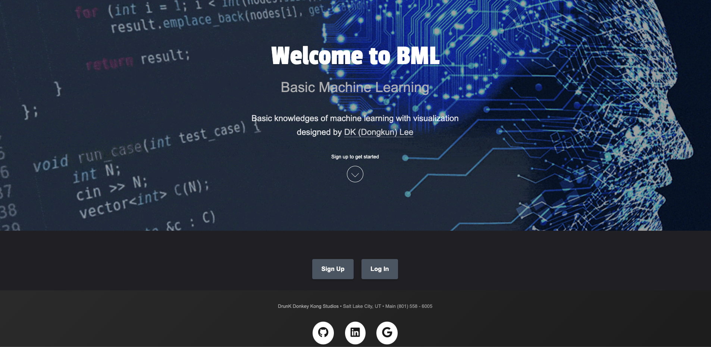
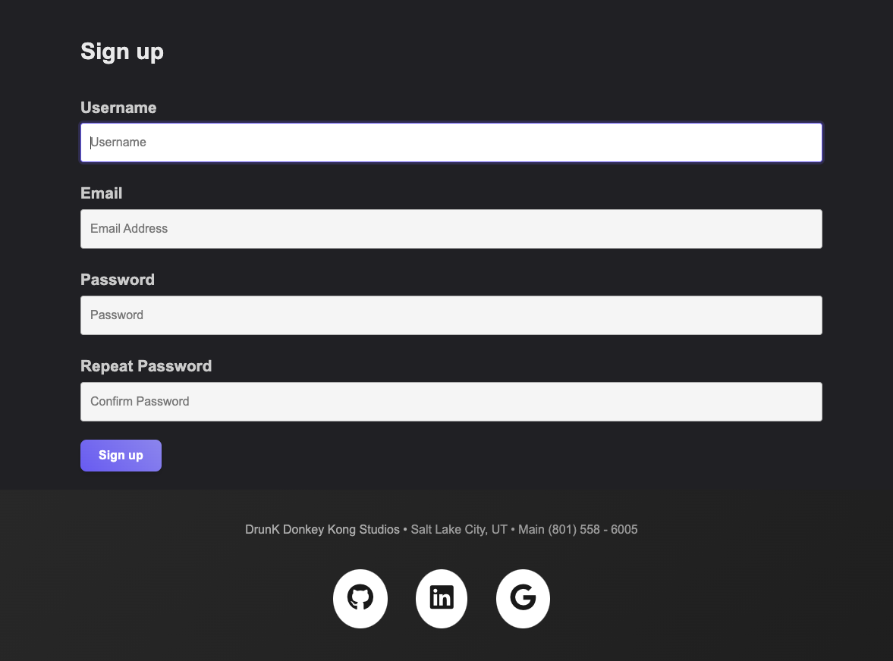
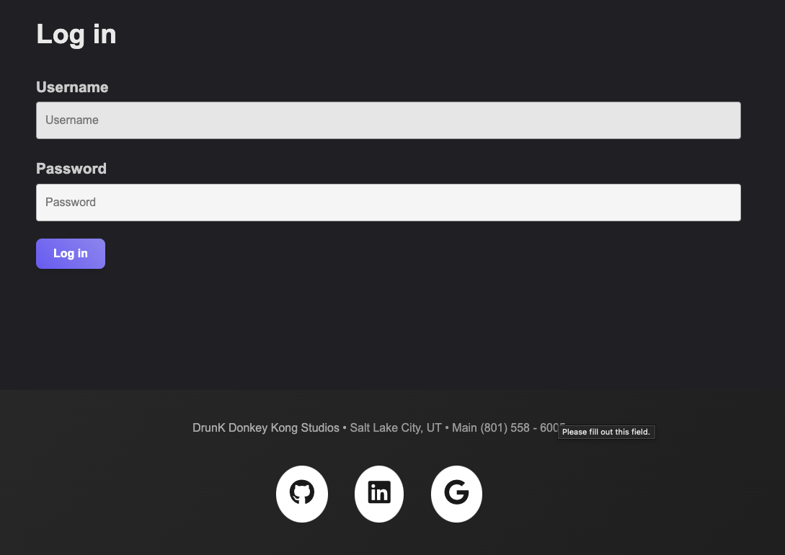
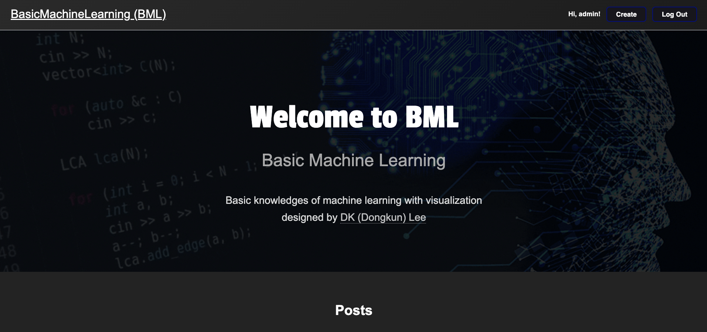
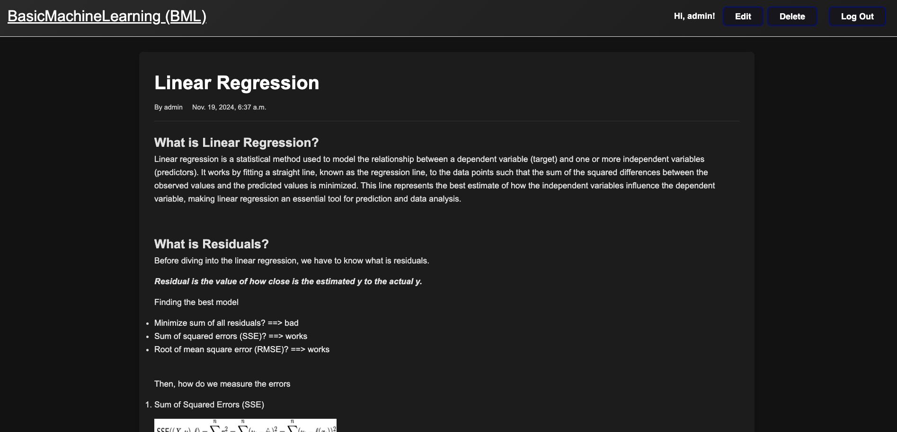

# Basic Machine Learning Website

**Live Demo:** [https://basicmachinlearning.onrender.com](https://basicmachinlearning.onrender.com)

A full-stack web application for creating, managing, and sharing educational articles about machine learning. This content management system features role-based access control, rich text editing, and cloud-based media storage.

## Tech Stack

### Backend
- **Python 3.13** - Core programming language
- **Django 5.1.3** - Web framework with MVT architecture
- **PostgreSQL** - Production database (via Render)
- **SQLite** - Development database
- **Gunicorn** - WSGI HTTP server for production
- **WhiteNoise 6.8.2** - Static file serving

### Frontend
- **HTML5/CSS3** - Structure and styling
- **Django Templates** - Server-side rendering
- **CKEditor 5** - Rich text WYSIWYG editor with custom toolbar configuration

### Cloud Services & Integrations
- **Cloudinary** - Cloud-based image storage and CDN for thumbnails and media
- **Render** - Deployment platform and managed PostgreSQL hosting

### Key Dependencies
- **django-environ** - Environment variable management
- **psycopg2-binary** - PostgreSQL database adapter
- **Pillow** - Image processing library
- **dj-database-url** - Database URL configuration

## Features

### Authentication & Authorization
- Secure user registration and login system
- Session-based authentication
- Custom user profiles with role-based permissions
- Admin-controlled content creation privileges

### Content Management
- CRUD operations for blog posts
- Rich text editor with image upload support
- Category-based article organization
- Post thumbnails with cloud storage
- Search functionality for discovering articles

### User Interface
- Responsive grid layout for article browsing
- Navigation bar with conditional rendering based on user permissions
- Homepage banner displaying user information
- Post detail pages with formatted content display

## Architecture & Project Structure

### Django Apps
- **core/** - User authentication, profiles, and homepage views
- **posts/** - Blog post models, views, and CRUD operations
- **templates/** - HTML templates with base layout and component templates
- **static/** - CSS, JavaScript, and static assets

### Database Schema
- **User** - Django's built-in authentication model
- **Profile** - Extended user model with `can_create_post` permission flag
- **Post** - Article model with author, title, description, rich content, category, thumbnail, and publish date
- **Category** - Taxonomy for organizing posts

### Deployment Configuration
- Environment-based settings (development/production)
- Static file handling with WhiteNoise
- CSRF protection and security middleware
- Cloudinary integration for media storage in production
- PostgreSQL database connection via dj-database-url

## Screenshots

### Welcome Page


### User Authentication
**Sign Up**


**Login**


### Homepage


### Post Detail Page


## Key Functionality
- View list of published posts
- Search posts by title or content
- Read full post details with formatted content

**Authorized Users Only:**
- Create new posts with rich text editor
- Edit existing posts
- Delete posts

## Technical Highlights

- **Full-Stack Development**: Complete Django application from database design to frontend implementation
- **Cloud Integration**: Cloudinary CDN for scalable media storage and delivery
- **Security Best Practices**: CSRF protection, password validation, and role-based access control
- **Production Deployment**: Configured for deployment on Render with environment-based settings
- **Database Management**: ORM-based data modeling with PostgreSQL in production
- **Rich Text Editing**: Custom CKEditor 5 configuration with image upload and formatting capabilities

## Local Development Setup

1. Clone the repository:
```bash
git clone https://github.com/DKunLee/BasicMachinLearning.git
cd BasicMachinLearning
```

2. Create and activate virtual environment:
```bash
python -m venv env
source env/bin/activate  # On Windows: env\Scripts\activate
```

3. Install dependencies:
```bash
pip install -r requirements.txt
```

4. Set up environment variables (create `.env` file):
```
ENVIRONMENT=development
SECRET_KEY=your-secret-key
```

5. Run migrations:
```bash
python manage.py migrate
```

6. Create superuser:
```bash
python manage.py createsuperuser
```

7. Run development server:
```bash
python manage.py runserver
```

## Contact
- **Author:** DK (Dongkun) Lee
- **Email:** ldkun2001@gmail.com
- **GitHub:** [DKunLee](https://github.com/DKunLee)
